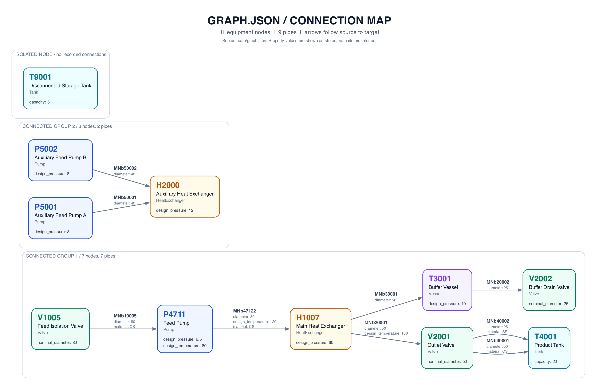

# PID Graph Agent

A small CLI for querying an already-constructed process graph with a local Qwen
model. The graph layer and all ordinary tests run without model weights.

A visualization of the input graph in `data/graph.json` is available at
[data/graph.png](data/graph.png).

> For this POC, the graph is represented as a JSON fixture modeled after DEXPI/pyDEXPI concepts. Graph construction from raw P&ID/DEXPI input is assumed to occur upstream and is outside the scope of this assignment.

> The agent framework is OpenAI Agents SDK, but inference is performed locally with Qwen. No OpenAI API key or hosted LLM API is required.



## 1) Install and run

Use Python 3.11 or newer with a PyTorch wheel available for your platform. Python
3.11 is the tested interpreter. From the repository root, install the dependencies
listed in `requirements.txt` and run the scripts directly:

```bash
python3.11 -m venv .venv
source .venv/bin/activate
python -m pip install -r requirements.txt
python -m pytest
python main.py --help
```

The CLI accepts `exit`/`quit` and reports controlled errors. The default graph is `data/graph.json` in this checkout.

Look up a registered node or pipe directly by its exact ID in the root location:

```bash
python main.py --query "H2000"
python main.py --query "MNb20002"
python main.py --query "Describe MNb20002"
python main.py --query "Pipe MNb20002"
python main.py --query "What is connected to H2000?"
python main.py --query "What is connected to P4711?"
python main.py --query "What equipment is directly downstream of H1007?"
python main.py --query "Find a directed path from P4711 to V2002."
python main.py --query "Give the diameter and material of all pipes from V2001 to T4001."
```

These short lookups use `get_entity` without loading Qwen. The graph determines
whether the ID is a node or an edge and supplies its actual type, description,
endpoints and properties. For example, H2000 is a HeatExchanger with
`design_pressure = 12`, and MNb20002 is the Pipe from T3001 to V2002 with
`diameter = 25`. IDs are case-sensitive. Unknown IDs produce an explicit
missing-entity message. No equipment type is inferred from an ID prefix.

`main.py` and `scripts/run_eval.py` locate the local source files automatically.
`pytest.ini` configures the test directory and adds `src` to the test import path.
After installing the dependencies, deterministic tests run without loading Qwen,
contacting model servers, requiring API credentials, or downloading weights.

## 2) Architecture


```text
data/graph.json → validated Python dict → GraphAccess

Short exact-ID description → recorded get_entity tool → GraphAccess
    → structured result → grounded renderer → readable answer

User question → OpenAI Agents SDK → Local Qwen → tool arguments
    → Tools → GraphAccess → Python dicts/lists → structured result
    → Local Qwen → verified evidence selection → readable answer
```

JSON makes the small static fixture inspectable and easy to test. `load_graph`
validates the file and returns a Python dictionary containing `nodes` and `edges`
lists. `GraphAccess` validates and copies those records, then indexes node IDs and
incoming/outgoing edge lists with built-in Python dictionaries. Directed parallel
connections retain their individual edge IDs. Breadth-first traversal implements
shortest paths and N-hop queries. Returned records are copies, so callers cannot
change the stored graph. Tools use only the public `GraphAccess` interface.

The OpenAI Agents SDK supplies the single-agent tool execution loop. The custom
`LocalQwenProvider` supplies `LocalQwenModel`, which maps SDK messages and tool
schemas to Qwen's native chat template. SDK tool outputs are correlated back into
Qwen history. Hosted
tracing is disabled even when an unrelated OpenAI API key exists in the environment.
The adapter never creates a hosted inference client. Streaming is not implemented.

The executable JSON schema lives in `schema.py`. The complete specification review,
repository structure and interface decisions are in [DESIGN.md](DESIGN.md).
[pyDEXPI](https://github.com/process-intelligence-research/pyDEXPI) is the domain
reference, not a runtime dependency. Equipment types and Pipe edges are a deliberate
simplification, not full DEXPI serialization or conformance.

**JSON for graph representation**

I chose JSON because the graph is static for this POC, easy to inspect, easy to
version in Git, and simple for both humans and agents to work with. It also avoids
unnecessary database infrastructure while keeping the data format portable.

**GraphAccess abstraction layer**

I added a graph-access layer to decouple the agent and tools from the underlying
storage and graph implementation. That means I can later replace the JSON-backed
Python implementation with Neo4j, a remote graph service, or another backend
without redesigning the agent or tool interfaces.

**OpenAI Agents SDK for agent orchestration**

I chose the OpenAI Agents SDK because this is a relatively lightweight,
tool-centric workflow. It lets me prototype quickly while handling the agent loop
and tool execution without adding the extra state-machine complexity of a heavier
orchestration framework.

**Local Qwen as the LLM**

I chose a small local Qwen model because the language task is relatively narrow:
understanding user intent, selecting the correct tool, generating structured
arguments, and selecting retrieved facts for short grounded answers. The
application validates those selections and renders the answer text. Running Qwen
locally also means the evaluator does not need an API key or paid hosted inference.

**pyDEXPI as a domain reference, not a runtime dependency**

I use pyDEXPI examples and DEXPI concepts as the reference for the mock graph
schema and equipment relationships, while assuming that graph construction has
already happened upstream. This keeps the implementation aligned with the domain
without adding unnecessary parsing or conversion work.

## 3) Graph and tool semantics

The fixture includes 11 equipment nodes and 9 pipe edges. 

| Tool | Purpose |
|---|---|
| `get_entity(entity_id)` | Exact node or edge lookup by ID, including full properties |
| `get_node(node_id)` | Exact metadata and properties |
| `search_nodes(query, node_type=None, resolve=False)` | Literal case-insensitive candidate search |
| `get_neighbors(node_id, direction="both", node_type=None, resolve=False)` | Direct equipment neighbors |
| `get_connected_edges(node_id, direction="both")` | Full incident pipe records |
| `get_edge(source, target, edge_id=None)` | Directed connections, retaining parallel edges. Both endpoints are required |
| `find_path(source, target)` | Shortest directed node path, retaining connection alternatives |
| `get_connected_subgraph(node_id, max_hops=1, direction="both", node_type=None)` | Bounded traversal and filtered match IDs |


## 4) Resolution, validation and grounding

For “everything connected to the pump upstream of H1007,” Qwen first requests
upstream Pump neighbors of H1007 with `resolve=true`. Only the unique candidate
P4711 becomes the target for subsequent neighbor/edge queries. A multi-candidate
resolution blocks dependent calls and yields clarification. an empty resolution
reports no match. Ordinary list queries can return multiple nodes. Correctly
recognizing when singular resolution is required remains a model capability.


User questions allow up to 200 characters, counting the original input including
spaces. At 201 characters or more, `InvalidInputError` is raised before model
execution. a nonblank 200-character question is allowed.

Custom exception classes in [errors.py](src/graph_agent/errors.py) distinguish
failure causes. `NodeNotFoundError` means a node is missing, `EdgeNotFoundError`
means a connection is missing, `EntityNotFoundError` means an ID matches neither
a node nor an edge, and `InvalidInputError` means an input is invalid.
Validation code detects the condition and raises the corresponding exception.
These exceptions inherit from `GraphAgentError` and provide distinct error codes
so tools and the CLI can report what went wrong.

Qwen's final response is a small structured selection of retrieved IDs and property
keys. The application validates it against this question's tool evidence and renders
literal graph facts. Missing properties receive an explicit “not available” message. Additional prose,
unretrieved IDs and extra value fields are rejected. This provides deterministic
fact grounding.

For example, ask: "What is the design pressure of P4711?" The `get_node` tool
returns `design_pressure: 6.5`, with no unit recorded. A freely written model answer
could accidentally change `6.5` to `650` or add an unsupported unit such as
`6.5 bar`. To prevent these mistakes, Qwen only selects the property to display:

```json
{
  "status": "answer",
  "node_ids": [],
  "edge_ids": [],
  "properties": [{"entity_id": "P4711", "key": "design_pressure"}]
}
```

`render_answer()` checks that P4711 was retrieved, reads the actual value from the
tool result recorded in `QueryContext.calls`, and produces:

```text
P4711: design_pressure = 6.5.
```

Qwen chooses what to include. Python supplies the recorded value and builds the
sentence. This keeps the output faithful to the retrieved data, at the cost of
less natural phrasing.

Grounding checks retrieved facts, not whether Qwen understood the question or
answered every part. For example, Qwen can select a recorded temperature when
the user asked for material. That answer can pass grounding even though it does
not answer the question. Live evaluation checks these interpretation failures.

The renderer also distinguishes node metadata (`id`, `name`, `type`,
`description`) from nested `properties`. If Qwen mistakenly selects a metadata
key as a property, the renderer uses the retrieved node's summary and prints it
once. For example, selecting P4711's `name`, `type`, and `description` this way
produces:

```text
P4711 (Pump): Feed Pump. Feed pump supplying heat exchanger H1007
```

If Qwen finishes without calling any graph tool, the agent asks it once to retrieve
evidence through a tool. The correction keeps the original question and response
history. A second answer without tool evidence remains blocked.

If a final response has invalid JSON syntax or the wrong structure after a lookup,
the agent allows one correction using the recorded tool results. For example,
Qwen may find the correct path but append an extra quote after the JSON object,
or return `properties` as a dictionary. The application retains the rejected text
in the conversation and asks Qwen to resubmit valid JSON. It does not trim quotes
or guess a repaired answer. Syntax, schema and evidence are checked again before
rendering. Python still reads values from the tool result. All corrections share one retry and the
original turn limit. Unsupported claims remain rejected. An already established
absence or ambiguity can be rendered directly without another model call.
Malformed tool calls and empty model output remain blocked by the adapter before
tool execution. Repeated final JSON errors are reported as `grounding_error`.


## 5) Tests and local evaluation

```bash
python -m pytest
python scripts/run_eval.py --model Qwen/Qwen3-1.7B
python scripts/run_eval.py --model Qwen/Qwen3-0.6B --cases tests/paraphrase_cases.json
python scripts/run_eval.py --cases tests/recovery_cases.json
```

The evaluation script reports JSON. Redirect it to `eval-results.json` to retain a
local report (ignored by git). Model loading may take time. Golden cases, reviewed
paraphrases and fuzz cases are in `tests/`. they use manually checked expectations,
not model-generated golden answers. Invalid-input cases check controlled failures.
By default, the script runs 29 cases: 18 from `eval_cases.json`, 3 paraphrases and
8 fuzz cases.

Unit tests cover graph operations, validation, tools, parser/history translation,
backend boundaries, grounding and CLI. Scripted model tests run through the real
SDK Runner to exercise multi-tool sequencing without weights. They establish
orchestration correctness, not live Qwen accuracy.


Deterministic tests deliberately supply malformed model output to exercise
recovery. A live Qwen run may produce valid output or fail before retrieving the
needed evidence, so these queries do not guarantee recovery is exercised.
Recovered evaluation rows include a `recovery` diagnostic. Schema scoring still
checks the raw model output, so recovery does not make invalid model JSON count
as valid. Rows also record `retry_count` and `final_outputs`, including every
completed final response before and after a correction. Any invalid final schema
or output parsing failure keeps the schema check failed.


## 6) First-run download and hardware

The default is `Qwen/Qwen3-1.7B`. Its first inference downloads public weights from
Hugging Face. later runs reuse the normal Hugging Face cache. The optional
`Qwen/Qwen3-0.6B` fallback uses less memory but is less reliable at tool selection.
These are local inference models.


| Environment variable | Default | Meaning |
|---|---|---|
| `QWEN_MODEL_ID` | `Qwen/Qwen3-1.7B` | Model ID or local model directory. `--model` overrides it |
| `QWEN_DEVICE` | `auto` | `auto`, `cpu`, `cuda`, `mps` |
| `QWEN_DTYPE` | `auto` | `auto`, `float32`, `float16`, `bfloat16` |
| `MAX_NEW_TOKENS` | `512` | Output token cap per model turn, 1–4096 |
| `MAX_INPUT_TOKENS` | `8192` | Input cap per model turn, 1–32768 |
| `MAX_TURNS` | `12` | SDK turn cap per query, 1–30 |
| `HF_HUB_OFFLINE` | unset | Set `1` to use cached model files only |


## 7) Limits and extensions


Potential production work includes a real upstream DEXPI pipeline, richer unit
and provenance types, larger reviewed evaluations, constrained decoding, retrieval
limits for large graphs, and an alternative `GraphAccess` backend. Those extensions
are intentionally outside this implementation.

As P&ID graph capabilities mature, NetworkX may be introduced for future extensibility.

References: [Qwen3-1.7B model card](https://huggingface.co/Qwen/Qwen3-1.7B),
[OpenAI Agents SDK models/providers](https://developers.openai.com/api/docs/guides/agents/models).
